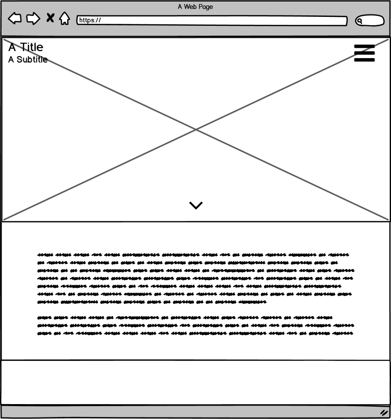
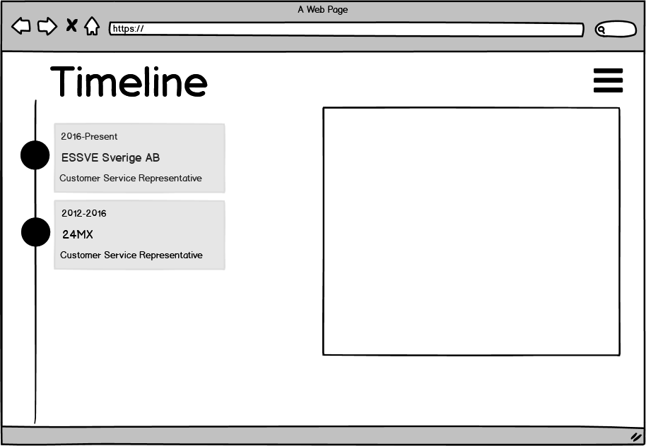

### Nicklas Jonsson - Portfolio

Welcome to my Portfolio,
This is where I'll display my projects and my personal information for potenial partners and employeers to view.

## UX

I've created this website so that I easely can display me, my experience and my projects, for potenial partners and employeers.

*It has an easy navigational layout with a reacurring structure for easy use.
*It arranges my work and educational history in a easy to understand, timeline.
*It will have a gallery with my former and ongoing projects, but this part is not finished. all projects will be displayed together with a link to the GitHub-page.
*The website has been created as a way to easely make contact with everyone that might be interested in what I do.

Firstly and foremost I wanted to do something useful so I decided to build a portfolio/resume.
Then I did some research close to myself; I talked to employeers that I'm in reaccurring contact with to get to know what I should focus on, and include.
Then I made a basic framework of the two first pages:

The Index:
{:height="50%" width="50%"}

The Timeline:
{:height="50%" width="50%"}

I then carried on looking in on how to approach it and after some Slack-discussions and some insights from my Mentor I decided to include [Bootstrap](https://getbootstrap.com/),
and to re-use some structural code from the two former projects; [Resume](https://github.com/The-element/UCD-Resume) and the [Bootstrap Intro](https://github.com/The-element/bootstrap-intro) and to work with the over-all layout first, before doing any of the finishing touches.
This is a ongoing project so please have indulgence.
And, I've also included [Font Awesome](https://fontawesome.com/).

## Features

### Existing Features:
* The first page is there only to briefly show who I am, What I want and to create more curiosity.
* The timeline page is created to display my work and educational history. The Timeline is structured from latest to oldest with the dates, the company and my title displayed.
  I've used the bootstrap function "Modal" here so every company-name is clickable to view even more information about my positions. Some of them will even include links.
* The about-me page is a short description about me and my skills. Here I've used the Bootstrap function for bars, to display my knowledge level of each skillset.
* The contact page has google maps with my home pointed out, inbedded as a iframe so that visitors won't have to spend the extra mile on finding out where I live.
  There is also a contact form here, except from my email and phonenumber that's displayed in the footer.

### Future Features to be included:
* I will add a subdomain including a gallery of my previous development projects. As for my Home Assistant project, This page, My former side business Wordpress-webpage, etc. All hosted on Github of course.

## Technologies Used

* [Bootstrap](https://getbootstrap.com/) - for easy creating the overall layout and functions.
* [Font Awesome](https://fontawesome.com/) - for inclusion of icons.
* [Jquery](https://jquery.com/) - to simplify DOM manipulation.

## Testing

I run my projects simultaneously as I write the code. This way I can make sure everything does what I expect it to do.
I can do my tweaks and test them as I write the code.

When all is finished, I try out each function and subdomain individually. To make sure everything works as expected.

During my testing I've noticed that the header doesn't shrink enough when the page is used on a small screen device so this is something I'll approach as soon as possible.
I've also noticed that some styles I've previously added to some subtitles has not been displaying correctly but I will fix that before submission.

All testing is done manually by me, and I'm picky so rest a sure I'll always do anything in my power to deliver a properlly working site.
All testing is done sequential, and structured. Like when testing forms;

1. I fill out the forms as one should and submit.
2. I then check to see if everything ended up where it's supposed to go.
3. I then check the error logs.
4. I do this again but with failing details, like a non-working mailaddress. To see what happens and if anything can be done differntly.

Lastly I always run developer tools one final time, to see that there aren't an obvious mistakes left.

## Deployment

I'm not sure on what information I should provide here concidering I've only regulary commited and pushed my work to GitHub, and thereafter,
in the settings, deployed it as a Github page.

## Credits

### Content:

* Code Institute projects 'Bootstrap Intro' and the 'UCD Resume' for some styling.

### Media:

* Code Institute project 'Bootstrap Intro' for the background of all pages.

### Acknowledgements:

* Code institue for giving me the knowledge I've recieved so far.
* My mentor Mr. Sandeep for his insights.
* All friends and acquaints for all the support.